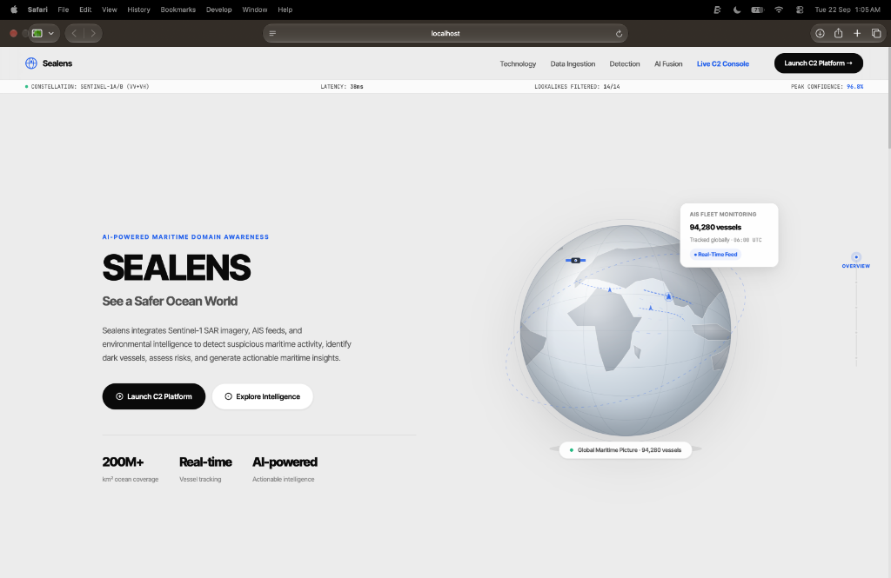
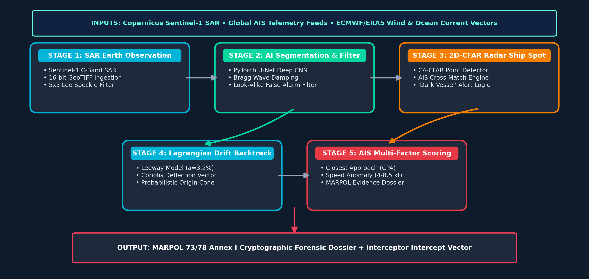
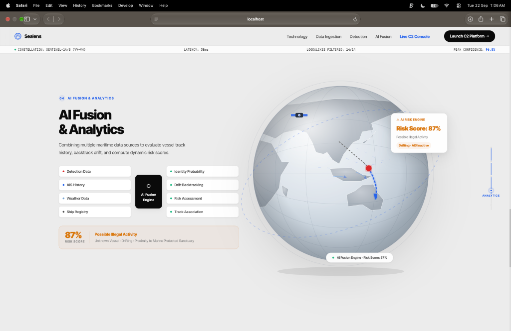
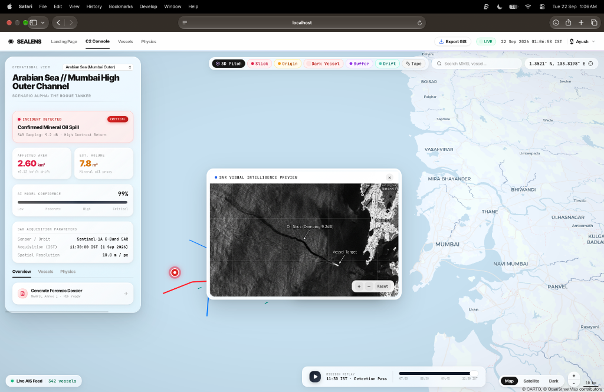
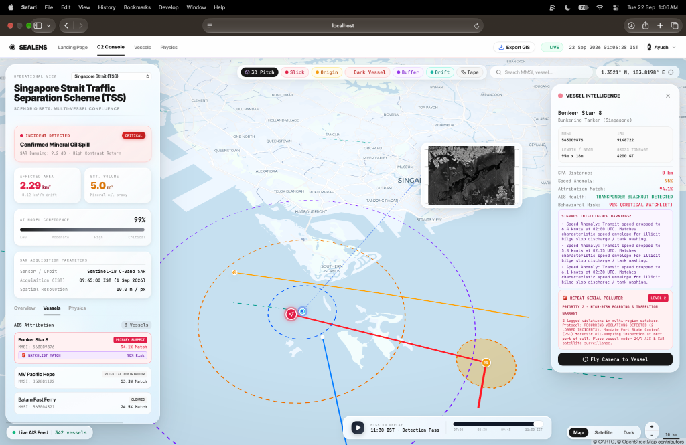
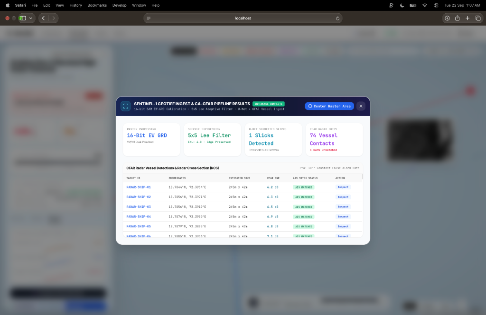
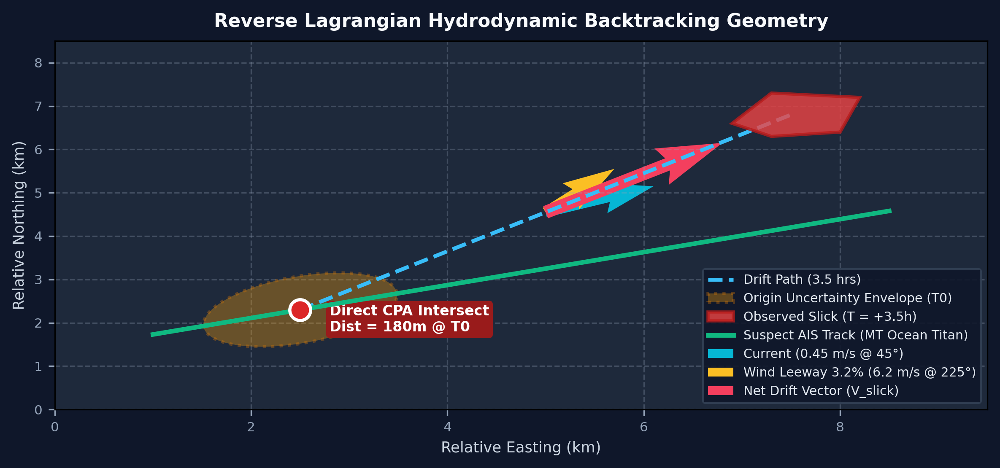
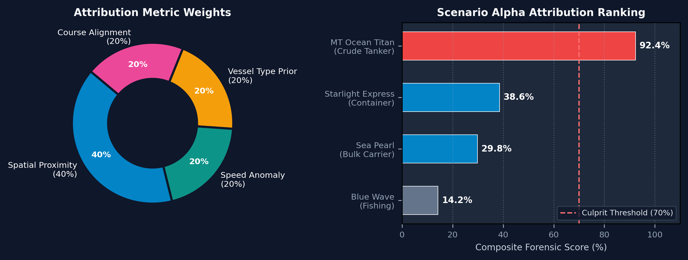

# 🌊 seaLens: AI Maritime Domain Awareness & C2 System
> **SIH Problem #143 (NTRO - National Technical Research Organisation)**  
> *Satellite Synthetic Aperture Radar (SAR) Oil Spill Detection, Dark Vessel Correlation & Reverse Drift Intelligence System*

---

## 📌 Executive Summary

**seaLens** is an end-to-end, AI-powered Maritime Domain Awareness (MDA) and Command & Control (C2) platform. It fuses **Sentinel-1 Synthetic Aperture Radar (SAR)** satellite Earth Observation with global **Automatic Identification System (AIS)** vessel telemetry to detect intentional and accidental marine oil discharges, reject natural look-alikes, back-calculate ocean drift physics to pinpoint discharge origin points, and correlate culprit vessels—even those operating with AIS transponders turned off (*Dark Vessels*).

```
 🛰️ Sentinel-1 SAR (VV/VH) ──┐
                             ├─► [ ML Segmentation & CFAR ] ──► [ Drift Backtrack ] ──► [ AIS Track Correlation ] ──► 🚨 Forensic Dossier
 🚢 Global AIS Telemetry ────┘
```

---

## 🖼️ Platform Overview & Visual Tour

### 1. Global Maritime Monitoring & Landing Console
The front-facing command portal provides high-level maritime metrics, constellation latency tracking, look-alike filter status, and real-time global vessel telemetry.



---

### 2. Multi-Layered System Architecture
`seaLens` operates across four distinct technical layers: SAR Processing, Hydrodynamic Physics, AIS Fusion, and Tactical Visualization.



---

### 3. AI Fusion & Multi-Source Risk Analytics
Combines polarimetric SAR segmentation, historical AIS track points, met-ocean weather data, and ship registries to calculate dynamic vessel threat indices.



---

### 4. Sentinel-1 GeoTIFF Ingestion & CA-CFAR Radar Detection
Processes raw 16-bit C-Band SAR GeoTIFFrasters. Runs adaptive Lee speckle filtering ($ENL = 4.8$), U-Net slick contour segmentation, and Cell-Averaging Constant False Alarm Rate (CA-CFAR) ship detection to flag un-matched radar targets.



---

### 5. Tactical C2 Console: Spill Segmentation & SAR Intelligence
Interactive tactical map equipped with dual-polarization SAR visual overlays, volumetric spill estimates ($km^2$ and $m^3$), confidence scoring, and one-click MARPOL Annex I Forensic Dossier PDF export.



---

### 6. Vessel Intelligence, Blackout Detection & Serial Polluters
Deep dive into culprit vessels showing transponder blackout warnings, speed anomaly signatures (e.g. transit speed drops matching bilge slop discharge), 3D spatial drift cones, and repeat offender watchlist alerts.



---

## 🔬 Core Technologies & Algorithmic Pipeline

### 1. SAR Image Processing & Deep Learning Segmentation
* **Polarimetric Feature Extraction**: Ingests Sentinel-1 C-Band SAR imagery with Dual-Polarization ($\text{VV} + \text{VH}$). Oil slicks suppress radar backscatter, appearing as dark patches due to surface capillary wave damping.
* **Lee Adaptive Speckle Filter**: Eliminates multiplicative speckle noise while preserving sharp boundaries:
  $$\hat{I} = \bar{I} + W \cdot (I - \bar{I}), \quad W = \frac{\text{Var}(I)}{\text{Var}(I) + \sigma^2}$$
* **U-Net / SegFormer Segmentation**: Deep convolutional neural network trained on annotated SAR imagery to predict pixel-level slick probability masks.
* **Met-Ocean Look-alike Rejection**: Integrates ECMWF ERA5 ocean surface wind vectors ($U_{10}$). Rejects false positives caused by natural low-wind calm waters ($< 2 \text{ m/s}$), biogenic slicks, and algae blooms.

### 2. CA-CFAR Radar Vessel Detection ("Dark Vessel Engine")
* **Cell-Averaging Constant False Alarm Rate (CA-CFAR)**: Detects hard radar metallic targets (ships) against background sea clutter with probability of false alarm $P_{fa} = 10^{-3}$.
* **Radar Cross Section (RCS) & SNR**: Calculates Radar Cross Section to estimate vessel dimensions and physical length.
* **AIS Matching**: Spatial matching between CFAR radar detections and live AIS positions. Unmatched radar returns are flagged as **Dark Vessels** operating in stealth mode.

### 3. Reverse Lagrangian Drift Physics
Reverses ocean drift to backtrack the slick from detection time $T_{\text{detect}}$ to illegal discharge time $T_{\text{origin}}$:

$$\vec{x}(t - \Delta t) = \vec{x}(t) - \left[ \vec{U}_{\text{current}}(x,t) + \beta \cdot \vec{U}_{\text{wind}}(x,t) \right] \Delta t$$

* **Current Vector Field $\vec{U}_{\text{current}}$**: Surface ocean currents derived from HYCOM / CMEMS data.
* **Wind Leeway Factor $\beta$**: $3\%$ windage factor applied to ERA5 10m wind vector field.
* **Spatio-Temporal Origin Cone**: Generates an expanding uncertainty ellipse $(X_0, Y_0, T_0)$ taking hydrodynamic dispersion into account.



### 4. Vessel Attribution & Risk Scoring Model
Intersects historical AIS vessel trajectories with the Spatio-Temporal Origin Cone to compute a composite risk score $S_{\text{vessel}} \in [0, 100\%]$:

$$S_{\text{vessel}} = w_1 \cdot S_{\text{CPA}} + w_2 \cdot S_{\text{speed\_anomaly}} + w_3 \cdot S_{\text{blackout}} + w_4 \cdot S_{\text{repeat\_offender}}$$



* **Closest Point of Approach ($S_{\text{CPA}}$)**: Spatial proximity of vessel trajectory to origin centroid $(X_0, Y_0)$ at $T_0$.
* **Speed Anomaly ($S_{\text{speed\_anomaly}}$)**: Flags vessels that decelerated to $5 \text{--} 7 \text{ knots}$ (characteristic speed envelope for tank washing / bilge discharge).
* **Transponder Blackout ($S_{\text{blackout}}$)**: Quantifies deliberate AIS power-down events during passage.
* **Repeat Serial Polluter Engine ($S_{\text{repeat\_offender}}$)**: Queries cross-regional historical databases to flag chronic offenders (Level 1 to Level 3 warrants).

---

## 🎯 Operational Demo Scenarios

| Scenario ID | Region / Location | Description | Key Focus Features |
| :--- | :--- | :--- | :--- |
| **`scenario_alpha_rogue_tanker`** | **Arabian Sea / Mumbai High** | Single rogue tanker discharge near offshore oilfields | Volumetric estimation, SAR Visual overlay, Legal PDF generation |
| **`scenario_beta_singapore_strait`** | **Singapore Strait TSS** | High-density traffic separation scheme with multi-vessel confluence | Dark vessel detection, AIS transponder blackout, Repeat polluter alert |
| **`scenario_gamma_lookalike`** | **Malacca Strait** | Low wind calm water area causing radar attenuation | ECMWF Met-Ocean look-alike filter rejection |
| **`scenario_epsilon_gulf_of_mannar`** | **Gulf of Mannar Sanctuary** | Discharge near delicate coral reef marine sanctuary | Forward drift simulation, Sensitive landfall ETA prediction |

---

## 💻 Tech Stack & Architecture

* **Backend / API**: Python 3.10+, FastAPI, Uvicorn, Pydantic v2
* **Machine Learning & Computer Vision**: PyTorch, OpenCV, NumPy, SciPy, Rasterio, SegFormer / U-Net
* **GIS & Physics Engine**: Shapely, PyProj, Geopandas, GeoTIFF processing, SciPy Differential Solvers
* **Frontend**: React 18, TypeScript, Vite, Leaflet, MapLibre GL, TailwindCSS, Lucide Icons
* **Reporting & Evidence Generation**: ReportLab PDF Engine, Matplotlib plotting

---

## ⚡ Quickstart Guide

### Prerequisites
* Python 3.10+
* Node.js 18+ & npm

### 1. Installation

```bash
# Clone the repository
git clone https://github.com/ayushrthakur/seaLens.git
cd seaLens

# Set up Python Virtual Environment
python3 -m venv venv
source venv/bin/activate
pip install -r requirements.txt
```

### 2. Run Test Suite
Verify pipeline mechanics, ML models, and drift physics:

```bash
python3 -m pytest tests/ -v
```

### 3. Launch Platform
Start the unified full-stack application (FastAPI backend + React Vite frontend):

```bash
python3 start.py
```

Once launched, access the endpoints:
* 🌐 **Landing Page**: [`http://localhost:8000`](http://localhost:8000)
* 🛰️ **Tactical C2 Console**: [`http://localhost:8000/c2`](http://localhost:8000/c2)
* 📖 **Interactive API Documentation**: [`http://localhost:8000/docs`](http://localhost:8000/docs)

---

## 🔌 API Endpoint Highlights

| Method | Endpoint | Description |
| :--- | :--- | :--- |
| `GET` | `/api/scenario/{scenario_id}` | Fetch detailed scenario geospatial payload & telemetry |
| `GET` | `/api/dark_vessels/{scenario_id}` | Retrieve CA-CFAR radar detections & AIS correlation matrix |
| `POST`| `/api/process_synthetic_geotiff` | Trigger on-demand 16-bit GeoTIFF SAR pipeline & CA-CFAR scan |
| `GET` | `/api/repeat_offender/{mmsi}` | Query vessel violation history & threat classification |
| `GET` | `/api/forward_drift/{scenario_id}` | Run forward Lagrangian drift & landfall ETA simulation |
| `GET` | `/api/download_pdf_report/{scenario_id}`| Generate and download MARPOL Annex I Evidence Dossier PDF |

---

## 📜 Problem Statement Compliance

Developed for **Smart India Hackathon (SIH) Problem Statement #143**, sponsored by the **National Technical Research Organisation (NTRO)**:
- [x] Automated SAR Oil Spill Detection & Contour Delineation
- [x] Rejection of Natural Look-alikes via Environmental Context
- [x] Spatio-Temporal Reverse Drift Modeling to Pinpoint Leak Origin
- [x] AIS Vessel Tracking & Dark Vessel Correlation
- [x] Legal PDF Evidence Dossier Generation for Maritime Enforcement

---

## 📄 License
This project is developed for maritime security, marine environmental protection, and research purposes under SIH #143 (NTRO).
